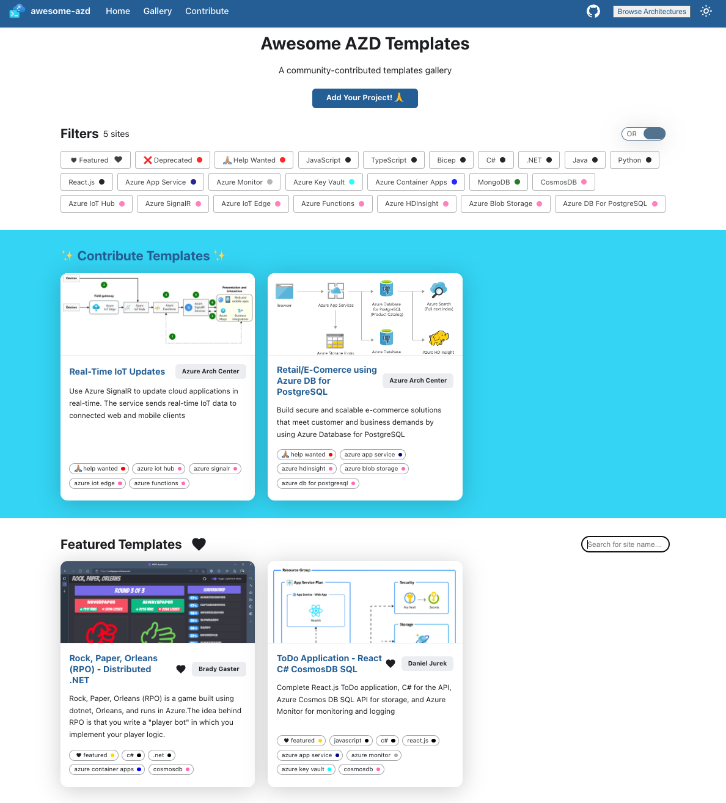
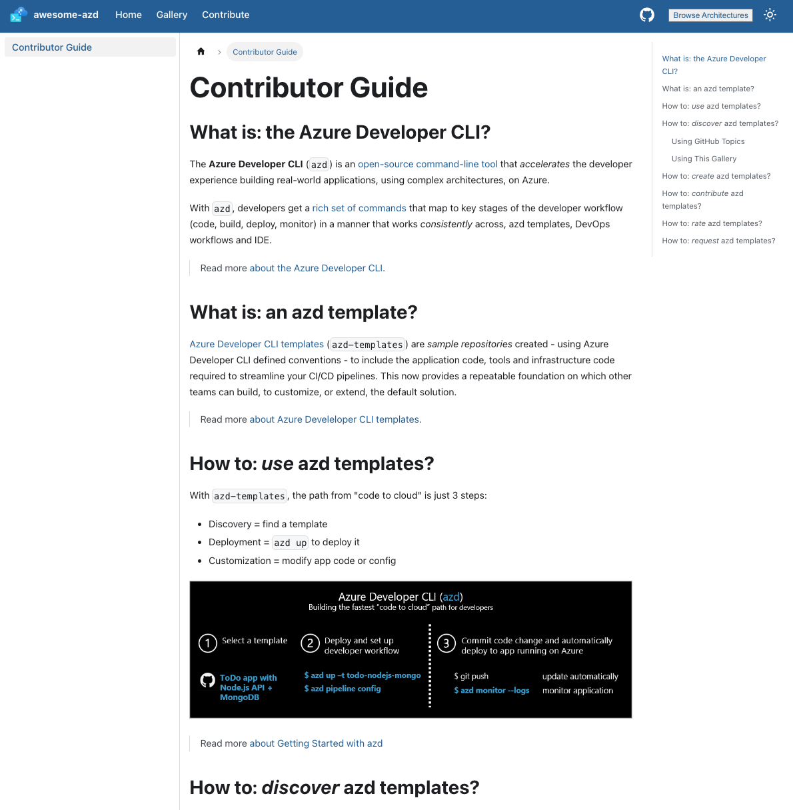

# AZD Templates Gallery

Currently, azd templates can be discovered using the [azd-templates](https://github.com/topics/azd-templates) topic on Github. We're working on adding a **hosted gallery** to this repo to simplify the process.

## 1. Landing Page

The **awesome-azd** site supports three behaviors:
 * Discovery of templates - see Gallery
 * Creation of templates - see Contributor Guide
 * Contribution of templates - see Custom Issue

---

## 2. Gallery Page

The Gallery page is a showcase of three kinds of templates:

* **HelpWanted** = calls for contribution tied to specific architecture diagrams that lack a template.
* **Featured** = highlighting validated high-quality templates from Microsoft and community.
* **Other** = collection of all other templates, ordered by name.

This page provides three key actions:
 * **Search** - use the search bar to discover templates by name or other text metdata.
 * **Filter** - use the AND/OR toggle to filter templates by a combination of provided tags.
 * **Contribute** - click the button to fill in a custom issue with details of _your_ template, for inclusion.

---

## 3. Contributor Guide
 

This is a **🚧 Work in Progress**. Use this to find documentation related to:
 * Creating a new template
 * Contributing a new template
 * Contributing a template for a requested architecture
 

---
