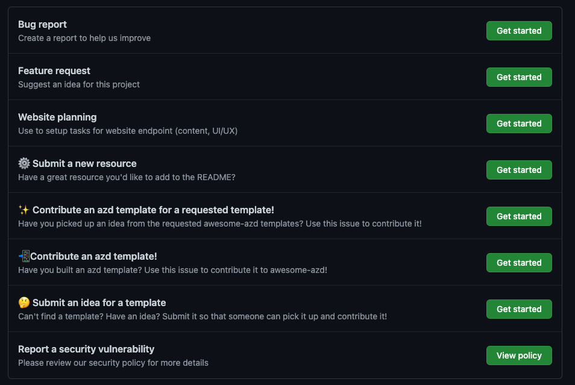

## We ♥️ Contributions!

`awesome-azd` is a community-friendly resource to help developer discover, create, and share, _azd-template_ resources for streamlining your application development and CI/CD pipelines. It is an _open-source_ effort open for contributions in many ways. 

## Our Custom Issues

The [custom issues](https://github.com/Azure/awesome-azd/issues/new/choose) page shows the different ways in which _anyone_ can contribute to make this project successful for _everyone_. 
Here are the 4 main ones:

 - submit a **resource** for the `awesome-azd/README.md` list
 - submit an **idea** for a template
 - contribute a **requested template** matching an idea
 - contribute a **new template** from your own project or idea

 

## Other Ways To Help 
Other than these, we always welcome feedback in terms of:
 - **bug reports**: let us know if something is broken
 - **feature requests**: let us know if something can improve your experience
 - **website planning**: for any other feedback (questions, comments etc.)

We'll capture _Frequently Asked Questions_ (with responses) in next section.

